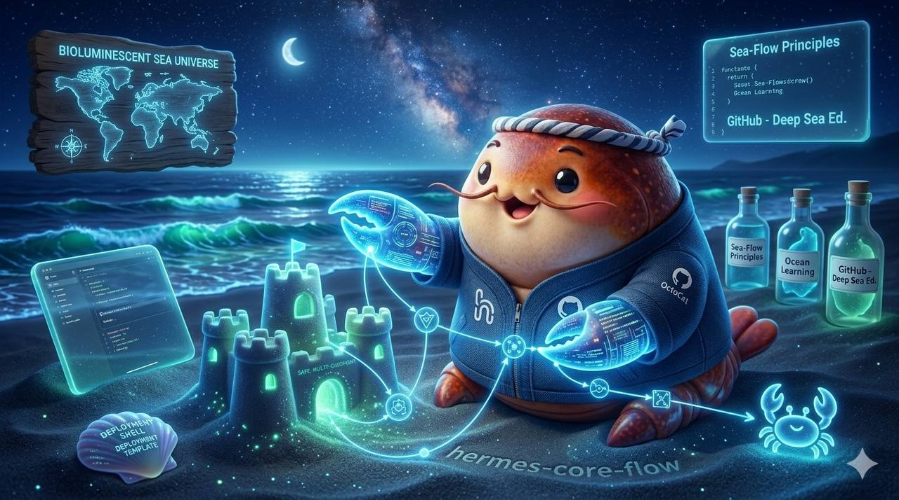

n
  n
  <h1>Agent Collaboration Protocol (ACP)</h1>n

n
---
name: agent-collaboration-protocol
description: A token-efficient, cross-platform (Hermes/OpenClaw) protocol for multi-agent coordination using structured file-based handoffs and task contracts.
---

# Agent Collaboration Protocol (ACP)

This protocol enables seamless handoffs between different AI agents by replacing volatile chat context with structured, file-based state snapshots. It follows the "SaveYourToken" philosophy: minimize context window usage by maximizing local structured memory.

## 📂 Directory Structure
All coordination artifacts live in `.acp/` (Agent Collaboration Protocol) at the project root.
- `.acp/contracts/`: Task definitions and 'Definition of Done' (DoD).
- `.acp/handoffs/`: State snapshots for agent transitions.
- `.acp/memory/`: Skeletal project state (decisions, architecture).

## 🤝 The Handoff Workflow (A $\rightarrow$ B)

When Agent A completes a sub-task and hands off to Agent B:
1. **Create Handoff File**: Agent A generates `.acp/handoffs/task-id.md`.
2. **Structure**:
   - **Status**: [Pending | Blocked | Completed]
   - **Context**: Minimum required facts to resume.
   - **Last Action**: What was just executed.
   - **Next Step**: Explicit first action for Agent B.
   - **Blockers**: Known issues/constraints.
3. **Transfer**: Agent B reads this file first before asking any questions.

## 📝 The Task Contract (SOP)

Before starting a complex feature, a Contract must be established in `.acp/contracts/feature-name.md`:
- **Objective**: One sentence goal.
- **Constraints**: Hard limits (e.g., "No new dependencies", "Max 100ms latency").
- **DoD (Definition of Done)**: A checklist of verifiable outcomes.
- **Approval**: User signature/timestamp.

## 🔄 Plan-Approve-Execute (PAE) Loop

To ensure reliability and token efficiency:
1. **Plan**: Agent proposes a `plan.md` including specific file changes.
2. **Approve**: User reviews the plan (saves tokens by preventing wrong directions).
3. **Execute**: Agent implements the approved plan.

## 🌍 Cross-Platform Compatibility
This protocol is platform-agnostic. Whether using **Hermes**, **OpenClaw**, or **Claude Code**, the agent only needs to:
1. Read `.acp/` directory.
2. Follow the Markdown templates.
3. Update the state files.
